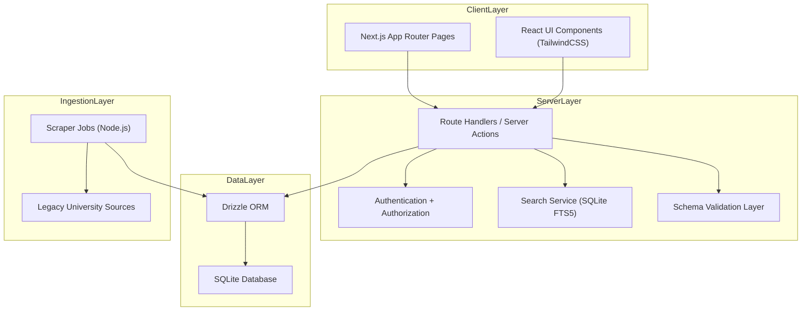

# IBS Student Digital Hub - Development Plan

## 1) Project Scope

- Project MUST deliver a centralized Student Digital Hub for IBS students.
- Project MUST reduce information fragmentation across HFU systems, documents, and email channels.
- Platform MUST support regular and international students.
- Platform MUST run as a single Next.js fullstack application.
- Platform MUST support both scraped legacy data and manual admin-maintained data.

## 2) Product Objectives

- Students MUST find required information in under 3 navigation steps for common flows.
- Students MUST identify correct contact persons by topic without manual directory browsing.
- Students MUST access semester-relevant documents, guides, and links from one dashboard.
- Admins MUST maintain all content without direct database edits.
- System MUST preserve auditability of scraped imports and manual updates.

## 3) Technical Architecture

### 3.1 Architecture Model



### 3.2 Deployment Topology

- Application MUST deploy as one Next.js service.
- SQLite database MUST be local file storage for development.
- Production deployment SHOULD move SQLite file to persistent volume.
- Scraper jobs MAY run inside the app runtime or via scheduled external worker command.

## 4) Tech Stack

- Framework MUST be Next.js 14+ with App Router.
- Language MUST be TypeScript with strict mode enabled.
- Styling MUST use TailwindCSS.
- Data layer MUST use SQLite + Drizzle ORM.
- Search MUST use SQLite FTS5 virtual tables for full-text search.
- Authentication MUST use session or JWT-based auth with role checks.
- Scraping MUST use Node.js HTML parsing (`cheerio`) and scheduler (`node-cron`).
- Validation SHOULD use `zod` for input and payload schemas.

## 5) Domain Model and Database Design

## 5.1 Core Entities

- `students` MUST store student profile and semester metadata.
- `contacts` MUST store professors/staff and contact channels.
- `documents` MUST store downloadable academic resources.
- `processes` MUST store multi-step guides.
- `platforms` MUST store external system catalog entries.
- `help_articles` MUST store onboarding and international support content.
- `topics` MUST normalize topic vocabulary.
- `scraper_jobs` MUST track ingestion execution history.

### 5.2 Relational Mapping

- `contacts` MUST have many-to-many relation with `topics` via `contact_topics`.
- `documents` SHOULD have many-to-many relation with `topics` via `document_topics`.
- `processes` SHOULD have many-to-many relation with `topics` via `process_topics`.
- `help_articles` MAY include `target_audience` enum (`all`, `international`, `first_semester`).
- `students` MAY include preference flags for dashboard personalization.

### 5.3 Suggested Table Contract

- `students(id, student_id, semester, role, created_at, updated_at)`
- `topics(id, slug, title, description)`
- `contacts(id, full_name, department, email, office_hours, notes, source_type, created_at, updated_at)`
- `contact_topics(contact_id, topic_id)`
- `documents(id, title, description, file_url, semester_min, semester_max, source_type, created_at, updated_at)`
- `document_topics(document_id, topic_id)`
- `processes(id, slug, title, overview, steps_json, semester_min, semester_max, source_type, created_at, updated_at)`
- `process_topics(process_id, topic_id)`
- `platforms(id, name, purpose, url, usage_instructions, source_type, created_at, updated_at)`
- `help_articles(id, slug, title, body_md, target_audience, source_type, created_at, updated_at)`
- `scraper_jobs(id, source_name, status, started_at, finished_at, inserted_count, updated_count, error_log)`

## 6) Functional Modules

### 6.1 Student Login System

- Login MUST support `student_id` + `semester`.
- Session MUST identify role (`student`, `admin`).
- Session MUST expire according to configurable TTL.
- Unauthorized users MUST be redirected from protected routes.

### 6.2 Personalized Student Dashboard

- Dashboard MUST show semester-relevant items.
- Dashboard MUST prioritize high-value shortcuts (documents, processes, contacts, platforms).
- Dashboard SHOULD include quick widgets for deadlines and recent updates.

### 6.3 Smart Search System

- Search MUST query across `documents`, `processes`, `contacts`, `help_articles`, and `platforms`.
- Search MUST support typo-tolerant ranking strategy where feasible.
- Search results MUST return content type, title, summary, and action link.
- Search SHOULD include filters: topic, semester, and content type.

### 6.4 Contact Finder

- Topic selection MUST return mapped contacts.
- Result cards MUST include professor/staff name, email, office hours, and responsibility scope.
- Empty mappings MUST provide fallback administrative contact.

### 6.5 Document Center

- Document list MUST support topic and semester filtering.
- Download action MUST provide direct file access.
- Each document MUST include short usage description.

### 6.6 Process Guide System

- Guides MUST provide step-by-step actionable flows.
- Each step SHOULD include required document links and responsible contact.
- Guides MAY include warning notes for common mistakes.

### 6.7 Student Help Center

- Help content MUST include international onboarding topics.
- Help articles SHOULD include links to official city/university pages.
- Help center SHOULD include category navigation and search.

### 6.8 Academic Platform Hub

- Hub MUST list all important university systems.
- Entry MUST contain purpose, direct link, and instructions.
- Entry SHOULD state when to use the platform (e.g., grades, enrollment, course materials).

## 7) Data Ingestion Strategy (Scrape + Manual)

### 7.1 Scraper Pipeline

- Scraper MUST support source adapters per legacy site.
- Job MUST parse, normalize, deduplicate, and upsert content.
- Each run MUST write a row in `scraper_jobs`.
- Failed runs MUST persist error logs for diagnostics.

### 7.2 Manual Content Operations

- Admin panel MUST support full CRUD for all primary content tables.
- Manual edits MUST override scraper conflicts by explicit precedence rule.
- System SHOULD track `source_type` (`scraped`, `manual`) per record.

### 7.3 Conflict Rules

- Manual records MUST NOT be silently overwritten by scraper runs.
- Scraped records MAY be auto-updated if unchanged by admin.
- Conflict resolution MUST be deterministic and auditable.

## 8) API and Route Design

### 8.1 Student-Facing Routes

- `/login`
- `/dashboard`
- `/search`
- `/contacts`
- `/documents`
- `/processes`
- `/help-center`
- `/platforms`

### 8.2 Admin Routes

- `/admin/login`
- `/admin/dashboard`
- `/admin/contacts`
- `/admin/documents`
- `/admin/processes`
- `/admin/help-articles`
- `/admin/platforms`
- `/admin/scraper-jobs`

### 8.3 Backend Endpoints (Route Handlers)

- `POST /api/auth/login`
- `POST /api/auth/logout`
- `GET /api/dashboard`
- `GET /api/search`
- `GET /api/contacts`
- `GET /api/documents`
- `GET /api/processes`
- `GET /api/help-articles`
- `GET /api/platforms`
- `POST /api/admin/*` (protected CRUD group)
- `POST /api/admin/scraper/run`
- `GET /api/admin/scraper/jobs`

## 9) Folder Structure

```text
WolfPowerSportsWeb/
  docs/
    ibs-student-hub-dev-plan.md
  frontend/
    src/
      app/
        (public)/
          login/
          dashboard/
          search/
          contacts/
          documents/
          processes/
          help-center/
          platforms/
        (admin)/
          admin/
            login/
            dashboard/
            contacts/
            documents/
            processes/
            help-articles/
            platforms/
            scraper-jobs/
        api/
          auth/
          dashboard/
          search/
          contacts/
          documents/
          processes/
          help-articles/
          platforms/
          admin/
      components/
      lib/
        auth/
        db/
        search/
        scraper/
        validation/
      drizzle/
        schema.ts
        migrations/
      scripts/
        scraper/
```

## 10) Security, Quality, and Governance

- Protected routes MUST enforce role checks server-side.
- Inputs MUST be validated before database writes.
- Output payloads SHOULD avoid exposing internal-only fields.
- Admin actions SHOULD be logged with actor and timestamp.
- File and URL fields MUST be sanitized.

## 11) Testing Strategy

- Unit tests MUST cover critical business logic: auth guards, search ranking, conflict rules.
- Integration tests MUST cover route handlers with SQLite test database.
- E2E tests SHOULD cover key user journeys:
  - Login and dashboard load.
  - Topic search and contact retrieval.
  - Document filtering and download.
  - Admin CRUD and scraper trigger.

## 12) Acceptance Criteria

- Student can log in and view semester-personalized dashboard.
- Student can retrieve contacts, documents, processes, and platform links from one system.
- Search returns relevant cross-module results.
- Admin can maintain all content types without direct database edits.
- Scraper jobs can be run, monitored, and audited.
- Manual data remains protected against non-authoritative scraper overwrite.

## 13) Risks and Mitigations

- Legacy source instability MAY break parsers; mitigation MUST include adapter isolation and error logging.
- SQLite concurrency limits MAY affect heavy write workloads; mitigation SHOULD include queued ingestion writes.
- Data correctness risk from scraping MUST be mitigated with admin review workflow for sensitive entries.

## 14) Immediate Next Actions

- Approve this development plan baseline.
- Confirm auth strategy choice (`NextAuth` vs custom JWT session).
- Confirm first legacy source to onboard for scraping pilot.
- Start Sprint 0 implementation.
